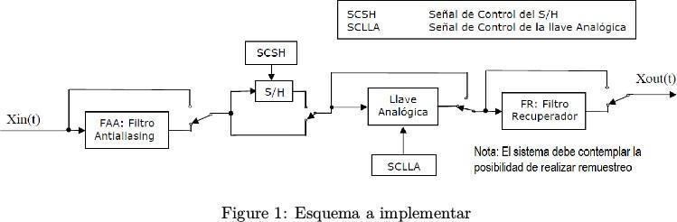
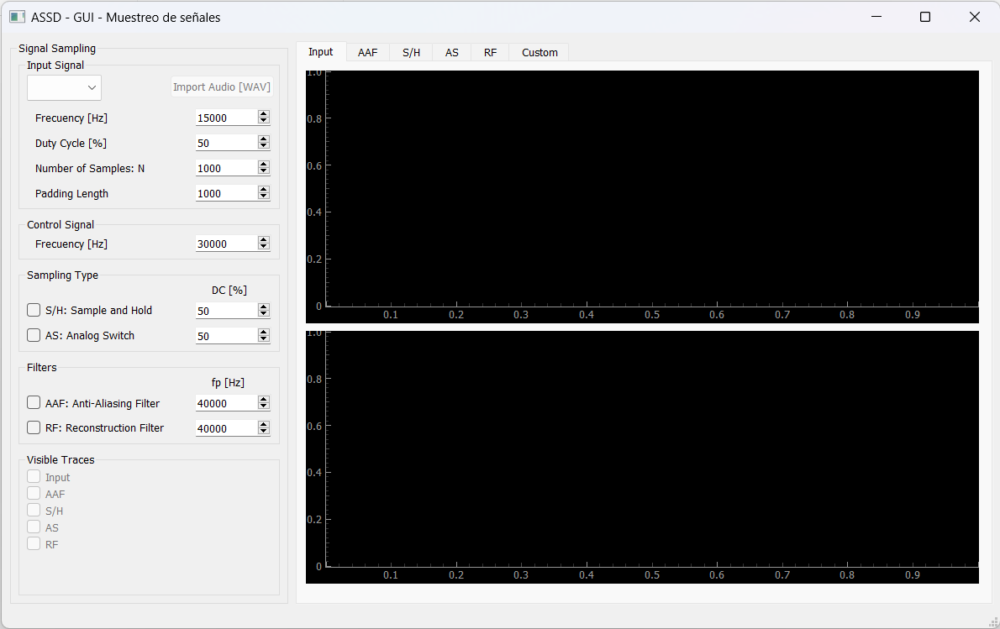

# Análisis de Señales y Sistemas Digitales 2024

## Trabajo Práctico N°1 - Muestreo

El esquema propuesto permite realizar el muestreo natural e instantáneo de una señal  
xin(t), y su recuperación con un error acotado.

#### Entorno de simulación

Desarrollar una GUI en Python que permita simular el comportamiento de las distintas  
partes de la placa de muestreo:

- FAA
- Sample and Hold
- Llave Analógica
- FR

Recuerde que al igual que la placa, se deberá utilizar exactamente la misma frecuencia  
para el muestreo natural que para el instantáneo. Se debe poder bypassear la etapa que  
se quiera y poder graficar en todos los nodos del sistema la señal en el tiempo y su  
espectro (pista: investigar qué hace la función “FFT”). Grafique los datos según  
considere necesario para dejar en evidencia el funcionamiento del sistema.

Entorno propuesto:

To install de packages write in terminal the folowing command:  
**pip install -r requirements.txt**